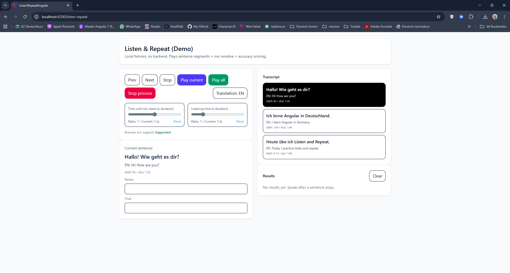
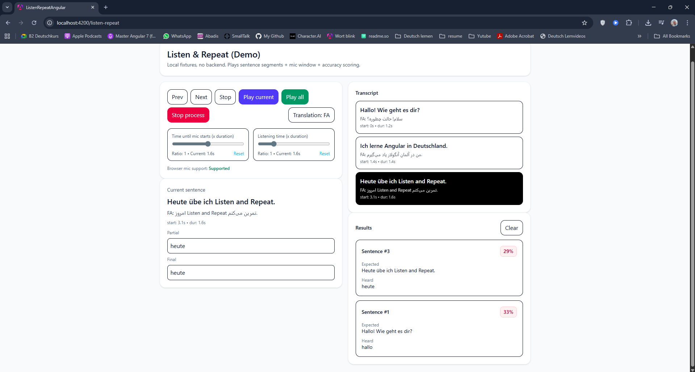
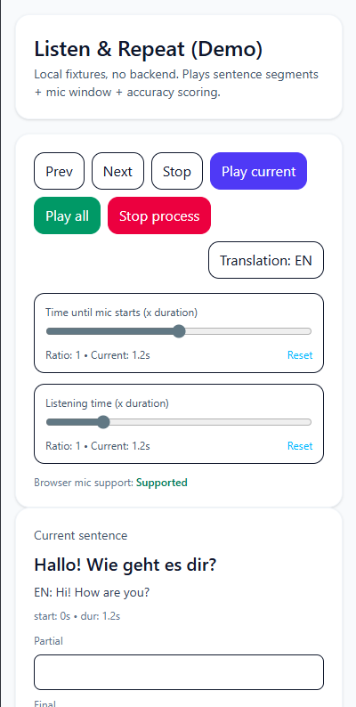
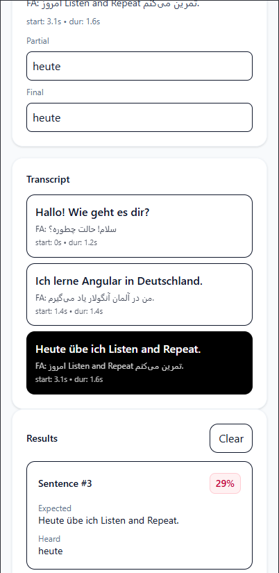
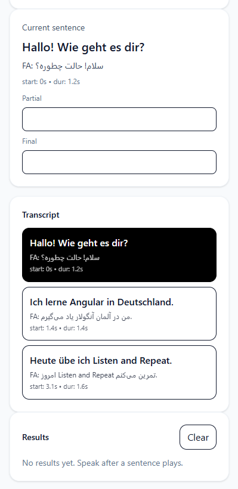

# Listen & Repeat (Angular Demo)

A focused **portfolio demo** showcasing a “Listen & Repeat” learning flow:
- Play **sentence-by-sentence** audio segments using timestamps
- Start the microphone after a configurable delay window
- Capture speech and calculate a simple **accuracy score**
- Run fully offline with **local fixtures** (no backend required)

> Built to be easy for recruiters/engineers to run and understand.

---

## Features

- **Segment playback** (start + duration per sentence)
- **Auto mic timing**
  - *Time until mic starts* (ratio × sentence duration)
  - *Listening time* (ratio × sentence duration)
- **Play current** and **Play all** (full session autoplay)
- **Stop process** (cancel autoplay and listening)
- **Translation toggle** (FA / EN)
- **Speech matching results** shown as cards (Expected vs Heard + % score)
- **No backend**: runs with local JSON fixture + local audio file

---

## Tech Stack

- Angular v20 (standalone components, control flow `@if/@for`)
- TypeScript
- TailwindCSS
- RxJS (HttpClient)
- Web APIs:
  - `HTMLAudioElement` for audio playback
  - Web Speech API (`SpeechRecognition` / `webkitSpeechRecognition`) for speech capture

---

## Run Locally

```bash
npm install
npm start
```

Open: `http://localhost:4200`

---

## How to Use

1. Click **Play current** to play the selected sentence segment.
2. After playback, the app waits for **Time until mic starts**, then listens for **Listening time**.
3. Speak the sentence. The app shows:
   - Partial transcript
   - Final (or a fallback transcript)
   - A score card in **Results**

Use:
- **Play all** to autoplay the entire session.
- **Stop process** to cancel autoplay and stop listening.
- **Translation: FA/EN** to switch which translation is displayed.

---

## Fixtures (No Backend)

All demo data is served from `public/`:

- `public/fixtures/sample-session.json`
- `public/audio/sample.wav` (or `.mp3`)

The fixture references audio like this:

```json
{
  "audioFile": "/audio/sample.wav"
}
```

---

## Browser Notes

SpeechRecognition works best in **Chrome**.
If speech is not supported, the UI will show a warning and the scoring will be limited.

---

## Project Structure

```txt
src/app/listen-repeat/
  pages/listen-repeat-page/        # Container page + layout + audio element
  components/                      # UI components (controls/current/transcript/results)
  facade/                          # App state + orchestration (play, listen, autoplay)
  services/                        # Audio segment player, SpeechRecognition wrapper
  models/                          # Session + sentence types
  utils/                           # Scoring utilities (token-based F1)

public/
  fixtures/                        # JSON fixtures (no secrets)
  audio/                           # Demo audio files

docs/
  images/                          # Screenshots / GIFs referenced in README
  architecture.md                  # Architecture overview
  decisions.md                     # Key technical decisions
  fixtures.md                      # Fixture format and examples
  testing.md                       # Testing plan
```
---

## Roadmap

- Add automated tests (facade + utils + minimal component tests)
- Improve speech scoring (phonetic/levenshtein fallback, language-specific normalization)
- Add more fixtures (different languages) to demonstrate flexibility

---

## Screenshots / GIFs

### Desktop


### Results (Scoring)


### Mobile
<p>
  
  
  
</p>

<p>
  
</p>

---

## License

MIT
